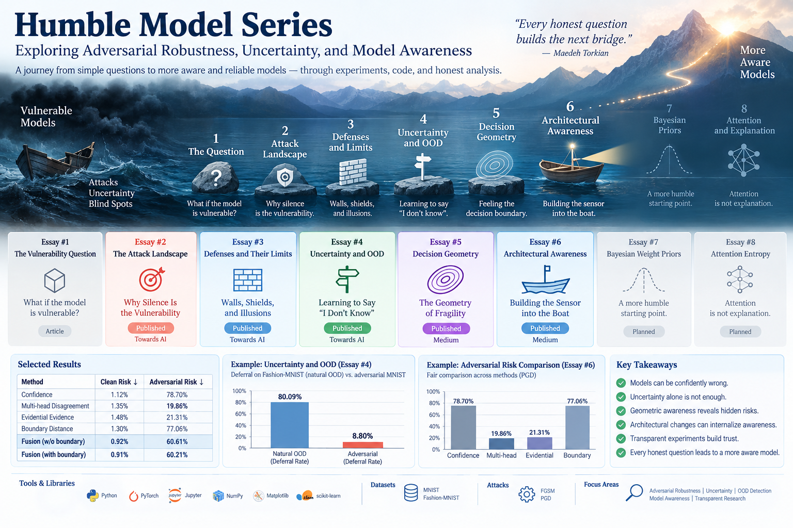

# Humble Model Series

Exploring adversarial robustness, uncertainty, and model awareness through experiments, notebooks, and technical essays.



## Why This Repository Exists

This repository is not simply a collection of notebooks.

**It is a record of an evolving investigation.**

Each notebook accompanies an essay.  
Each essay begins with a question.  
Each question changes the next experiment.

> Some conclusions may change.  
> Some assumptions may fail.

That is part of the process.

**Do not ask the experiment to confirm the question.**  
**Ask it to change the question.**

---

## Research Question

The series began with a simple question:

> **How are we vulnerable?**

From there, the investigation moved through adversarial perturbations, defenses, uncertainty, out-of-distribution detection, decision-boundary geometry, and architectural awareness.

The broader question gradually became:

> **Can a model become more aware of when its own predictions may be unreliable?**

The goal of this repository is not only to reproduce results, but to document the process of inquiry — including experiments, failures, changing assumptions, and unexpected directions.

---

## Reading Path

If you are new to the series, I recommend reading the essays in order:

1. **Essay #1** — *The Fog of Certainty: On Deep Learning's Secret Vice*  
   Published on Medium

2. **Essay #2** — *The Attack Landscape: Why Silence Is the Vulnerability*  
   Published in Towards AI

3. **Essay #3** — *Walls, Shields, and Illusions: Defenses and Their Limits*  
   Published in Towards AI

4. **Bridge Essay** — *The Bridge: From Resistance to Awareness — Why Defenses Alone Will Never Be Enough*  
   Published on Medium

5. **Essay #4** — *Learning to Say “I Don’t Know”: The First Floor of Awareness*  
   Published in Towards AI

6. **Essay #5** — *The Geometry of Fragility: Feeling the Decision Boundary*  
   Published on Medium

7. **Essay #6** — *Architectural Awareness: Building the Sensor into the Boat*  
   Published on Medium

8. **Essay #7** — Bayesian Weight Priors  
   Planned / in progress

9. **Essay #8** — Attention Entropy  
   Planned

---

# Adversarial AI: Attacks, Defenses, and Model Awareness

> *The attacker adapts. The wall crumbles.*  
> *The researcher adapts. The question changes.*

This repository accompanies an ongoing study of adversarial attacks, defenses, uncertainty, and model behavior.

The series is intentionally cumulative: each experiment exposes a limitation that motivates the next question.

---

## Series Roadmap

### Essay #1 — *The Fog of Certainty: On Deep Learning's Secret Vice*

The starting point of the series.

The essay begins with a shift in framing:

> Not “Are we vulnerable?” — but “How are we vulnerable?”

It explores adversarial vulnerability, assumptions about robustness, and the foundations of the questions developed throughout the series.

📖 **Article**  
[Read on Medium](https://medium.com/@maedehtorkian/the-fog-of-certainty-on-deep-learnings-secret-vice-ed73d6ac3242)

**Notebook**
- No companion notebook for this essay.

---

### Essay #2 — *The Attack Landscape: Why Silence Is the Vulnerability*

A study of adversarial behavior beyond visible failures, asking whether omission, selective behavior, and silence can themselves become vulnerabilities.

📖 **Article**  
[Read in Towards AI](https://pub.towardsai.net/the-attack-landscape-why-silence-is-the-vulnerability-f27dabfccb9b)

**Notebook**
- [FGSM Adversarial Notebook](./fgsm_adversarial_notebook.ipynb)

---

### Essay #3 — *Walls, Shields, and Illusions: Defenses and Their Limits*

An exploration of adversarial training, defensive distillation, gradient masking, and a deeper question:

> **Can any defense remain unbreakable given enough computational power and knowledge of the model?**

If every wall eventually breaks, then the entire framework of defense begins to look incomplete.

📖 **Article**  
[Read in Towards AI](https://medium.com/towards-artificial-intelligence/walls-shields-and-illusions-defenses-and-their-limits-cd67b6ec4f92)

**Notebook**
- [Adversarial Training with PGD](./%233/Note02_Adversarial_Training_PGD.ipynb)

---

### Bridge Essay — *The Bridge: From Resistance to Awareness*

**Why Defenses Alone Will Never Be Enough**

The bridge asks a different question.

Instead of:

> How can we build a stronger wall?

it asks:

> What if resistance alone is the wrong objective?

This essay connects adversarial robustness with a broader perspective: **model awareness**.

It is not the conclusion of the first part of the journey.  
It is the path leading to the next one.

📖 **Article**  
[Read on Medium](https://medium.com/@maedehtorkian/the-bridge-from-resistance-to-awareness-58ea4156ad3f)

**Notebook**
- No companion notebook for this essay.

---

### Essay #4 — *Learning to Say “I Don’t Know”: The First Floor of Awareness*

We built the voice.

A decision gate — a simple, auditable rule that says:

> “If uncertainty is high, do not predict. Ask for help.”

This is not a new wall.

> **It is a voice, and it is the first floor of a structure this series will keep building on.**

The experiment showed a strong ability to defer on natural out-of-distribution data, while exposing a major limitation under adversarial perturbation.

📖 **Article**  
[Read in Towards AI](https://pub.towardsai.net/learning-to-say-i-dont-know-the-first-floor-of-awareness-1a9faae389c0)

**Notebook**
- [Essay #4 Notebook](./%234/Notebook_%234.ipynb)

---

### Essay #5 — *The Geometry of Fragility: Feeling the Decision Boundary*

We gave the model a voice — a way to say:

> “I am not sure.”

and

> “This input looks strange.”

It worked on natural data.

But it failed on adversarial data.

**That was the blind spot we needed to close.**

The model needed to become aware not only of the data distribution, but also of its own decision geometry.

This essay explores boundary proximity as a signal of fragility.

📖 **Article**  
[Read on Medium](https://medium.com/@maedehtorkian/the-geometry-of-fragility-feeling-the-decision-boundary-2d1c50f402ee)

**Notebook**
- [Essay #5 Notebook](./%235/Notebook_5.ipynb)

---

### Essay #6 — *Architectural Awareness: Building the Sensor into the Boat*

The architecture was still designed primarily to produce predictions.

Awareness had been added afterward through external measurements and decision gates.

Now the question changed:

> **Can we design the boat itself to be more aware?**

> **Can uncertainty become part of the architecture rather than an external attachment?**

This essay explores two directions:

1. **Multiple Prediction Heads** — a shared backbone with several prediction heads whose disagreement becomes an internal uncertainty signal.
2. **Evidential Outputs** — a model whose output contains not only a prediction, but also an estimate of the evidence supporting that prediction.

The results show that internal architectural signals can outperform plain confidence under adversarial evaluation, while also revealing the limits of combining signals naively.

📖 **Article**  
[Read on Medium](https://medium.com/@maedehtorkian/architectural-awareness-building-the-sensor-into-the-boat-c8545beedd3c)

**Notebook**
- [Essay #6 Notebook](./%236/Notebook_6.ipynb)

---

### Essay #7 — *Bayesian Weight Priors*

Planned next direction.

The next question is whether uncertainty can be introduced even earlier — not only in predictions or evidence, but in the model parameters themselves.

**Status:** Planned / in progress

---

### Essay #8 — *Attention Entropy*

Planned future direction.

This part of the series will explore whether attention behavior can provide useful internal signals while keeping an important caution in view:

> **Attention is not explanation.**

**Status:** Planned

---

## Selected Experimental Results

### Essay #4 — Natural OOD vs. Adversarial Deferral

- Natural OOD deferral: **80.09%**
- Adversarial deferral: **8.80%**

This experiment showed that uncertainty and OOD detection could identify unfamiliar natural inputs while still failing to recognize many adversarially perturbed inputs.

---

### Essay #6 — Fair Adversarial Risk Comparison

| Signal | Adversarial Risk |
|---|---:|
| Confidence | 78.70% |
| Multi-head disagreement | 19.86% |
| Evidential evidence | 21.31% |
| Boundary distance | 77.06% |

### Fusion Results

| Fusion | Adversarial Risk |
|---|---:|
| Without boundary | 60.61% |
| With boundary | 60.21% |

These results suggest that multi-head disagreement and evidential signals provided substantially stronger adversarial-risk separation than confidence or boundary distance alone under the fair comparison setup.

---

## Research Themes

The series currently explores:

- adversarial attacks
- adversarial defenses
- uncertainty estimation
- out-of-distribution detection
- selective prediction
- decision-boundary geometry
- architectural uncertainty
- evidential deep learning
- model awareness
- trustworthy and transparent ML experimentation

---

## Tools and Datasets

### Tools

- Python
- PyTorch
- NumPy
- Matplotlib
- scikit-learn
- Jupyter Notebook

### Datasets

- MNIST
- Fashion-MNIST
- CIFAR-10

### Adversarial Methods

- FGSM
- PGD

---

## Repository Structure

```text
/
├── #3/
├── #4/
├── #5/
├── #6/
├── #7/
├── fgsm_adversarial_notebook.ipynb
├── images/
└── README.md
```

> ** Not knowing is not the opposite of research; Not knowing is where research begins.**
